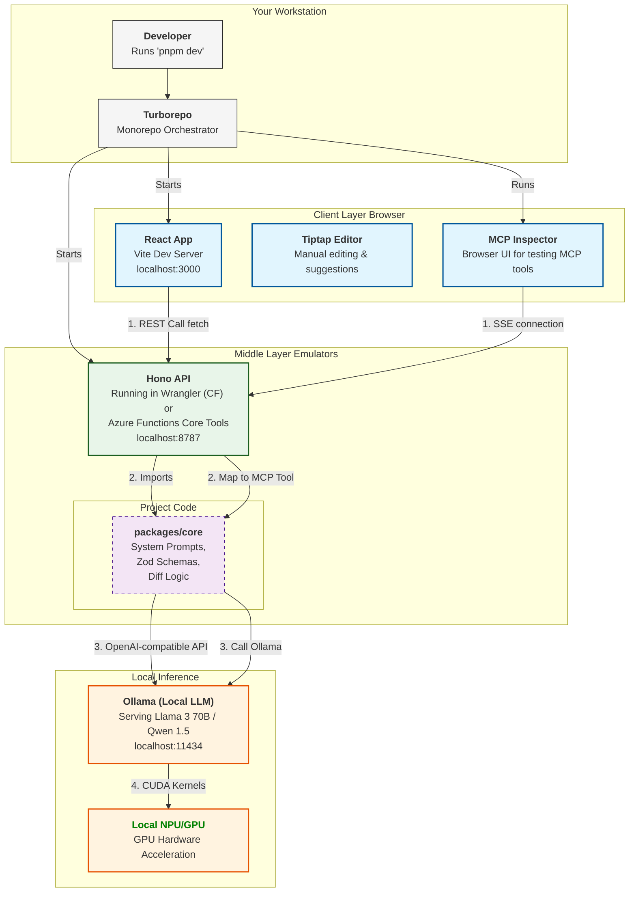

Development & Mocking Roadmap
This plan outlines how to build and test the application without incurring cloud costs or managing complex Docker containers.

Phase 1: Local Foundation & Inference
Setup: Initialize Turborepo with pnpm.

LLM Mocking: Use Ollama as the primary local mock. Configure packages/core to point to http://localhost:11434/v1 during development.

Goal: Ensure the core logic can successfully "Gap Analyze" a resume against a JD using a local 8B or 70B model.

Phase 2: The "Middle Layer" Emulator
Tooling: Use Wrangler Dev (Cloudflare) or Azure Functions Core Tools.

Action: Run the API locally. It should receive a resume from the frontend (or a curl request), attach the provided API key, and return an optimized Markdown string.

Mocking Transport: Use MCP Inspector (npx @modelcontextprotocol/inspector) to visually test tool calls without opening Claude Code.

Phase 3: Frontend & Manual UX
Editor: Implement Tiptap with "Suggestion" marks.

Testing: Use Mock Service Worker (MSW) or a local LLMock server to simulate "streaming" responses from the LLM. This allows you to polish the UI's "Accept/Reject" animations without waiting for real LLM inference.

Phase 4: Agent Bridge (MCP)
Integration: Connect the local API to Claude Code using the sse transport.

Verification: Ensure Claude can read a local file and trigger the optimize_resume tool via your local server.

